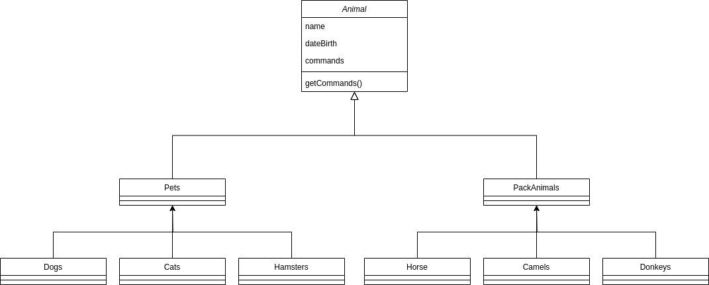

## Игнатьев Василий, группа 4589

***Итоговая контрольная работа:***

**Операционные системы и виртуализация (Linux)**

1. Использование команды cat в Linux:
   - Создать два текстовых файла: "Pets"(Домашние животные) и "Pack animals"(вьючные животные), используя команду `cat` в терминале Linux. В первом файле перечислить собак, кошек и хомяков. Во втором — лошадей, верблюдов и ослов.
   - Объединить содержимое этих двух файлов в один и просмотреть его содержимое.
   - Переименовать получившийся файл в "Human Friends"(.
````bash
ignasiya@ignasiya-MAG:~/final_work$ cat > Pets
собаки
кошки
хомяки
ignasiya@ignasiya-MAG:~/final_work$ cat > Pack_animals
лошади
верблюды
ослы
ignasiya@ignasiya-MAG:~/final_work$ cat Pets Pack_animals > Animals
ignasiya@ignasiya-MAG:~/final_work$ cat Animals
собаки
кошки
хомяки
лошади
верблюды
ослы
ignasiya@ignasiya-MAG:~/final_work$ mv Animals Human_Friends
````
2. Работа с директориями в Linux
   - Создать новую директорию и переместить туда файл "Human Friends".
````bash
ignasiya@ignasiya-MAG:~/final_work$ mkdir animals
ignasiya@ignasiya-MAG:~/final_work$ mv Human_Friends animals
ignasiya@ignasiya-MAG:~/final_work$ cd animals/
ignasiya@ignasiya-MAG:~/final_work$ ll
итого 12
drwxrwxr-x 2 ignasiya ignasiya 4096 ноя 27 18:30 ./
drwxrwxr-x 4 ignasiya ignasiya 4096 ноя 27 18:30 ../
-rw-rw-r-- 1 ignasiya ignasiya   76 ноя 27 18:29 Human_Friends
````
3. Работа с MySQL в Linux. “Установить MySQL на вашу вычислительную машину ”
   - Подключить дополнительный репозиторий MySQL и установить один из пакетов из этого репозитория.
````bash
ignasiya@ignasiya-MAG:~/final_work/animals$ wget https://dev.mysql.com/get/mysql-apt-config_0.8.26-1_all.deb
ignasiya@ignasiya-MAG:~/final_work/animals$ sudo dpkg -i mysql-apt-config_0.8.26-1_all.deb
ignasiya@ignasiya-MAG:~/final_work/animals$ sudo apt install mysql-client mysql-community-server mysql-server
ignasiya@ignasiya-MAG:~/final_work/animals$ sudo apt update
ignasiya@ignasiya-MAG:~/final_work/animals$ sudo mysql_secure_installation
ignasiya@ignasiya-MAG:~/final_work/animals$ sudo mysql
````
4. Управление deb-пакетами
   - Установить и затем удалить deb-пакет, используя команду `dpkg`.
````bash
ignasiya@ignasiya-MAG:~$ apt download lftp
ignasiya@ignasiya-MAG:~$ sudo dpkg -i lftp_4.9.2-1build1_amd64.deb
ignasiya@ignasiya-MAG:~$ sudo dpkg -r lftp
````
5. История команд в терминале Ubuntu
   - Сохранить и выложить историю ваших терминальных команд в Ubuntu.
````bash
  397  cat > Pets
  398  cat > Pack_animals
  399  cat Pets Pack_animals > Animals
  400  cat Animals 
  401  mv Animals Human_Friends
  402  ll
  403  mkdir animals
  404  mv Human_Friends animals
  405  ll
  406  cd animals/
  407  ll
  408  sudo apt install mysql-server
  409  wget https://dev.mysql.com/get/mysql-apt-config_0.8.26-1_all.deb
  410  sudo dpkg -i mysql-apt-config_0.8.26-1_all.deb
  411  sudo apt update
  412  sudo apt install mysql-client mysql-community-server mysql-server
  413  sudo mysql_secure_installation
  414  sudo mysql
  415  history
  416  apt download lftp
  417  sudo dpkg -i lftp_4.9.2-1build1_amd64.deb
  418  sudo dpkg -r lftp
  419  history 
````

**Объектно-ориентированное программирование** 

6. Диаграмма классов
   - Создать диаграмму классов с родительским классом "Животные", и двумя подклассами: "Pets" и "Pack animals".
В составы классов которых в случае Pets войдут классы: собаки, кошки, хомяки, а в класс Pack animals войдут: Лошади, верблюды и ослы).
Каждый тип животных будет характеризоваться (например, имена, даты рождения, выполняемые команды и т.д)
Диаграмму можно нарисовать в любом редакторе, такими как Lucidchart, Draw.io, Microsoft Visio и других.


7. Работа с MySQL (Задача выполняется в случае успешного выполнения задачи “Работа с MySQL в Linux. “Установить MySQL на вашу машину”

   7.1. После создания диаграммы классов в 6 пункте, в 7 пункте база данных "Human Friends" должна быть структурирована в соответствии с этой диаграммой. Например, можно создать таблицы, которые будут соответствовать классам "Pets" и "Pack animals", и в этих таблицах будут поля, которые характеризуют каждый тип животных (например, имена, даты рождения, выполняемые команды и т.д.).
   
   7.2.
   - В ранее подключенном MySQL создать базу данных с названием "Human Friends".
````SQL
DROP DATABASE IF EXISTS human_friends;
CREATE DATABASE human_friends;
````
   - Создать таблицы, соответствующие иерархии из вашей диаграммы классов.
````SQL
USE human_friends;

CREATE TABLE animals (
	id INT AUTO_INCREMENT PRIMARY KEY, 
	class_name VARCHAR(20)
);

INSERT INTO
	animals (class_name)
VALUES 
	('Pack_animals'),
	('Pets');  

CREATE TABLE pack_animals (
	id INT AUTO_INCREMENT PRIMARY KEY,
    subclass_name VARCHAR (20),
    class_id INT,
    FOREIGN KEY (class_id) REFERENCES animals (id) ON DELETE CASCADE ON UPDATE CASCADE
);

INSERT INTO 
	pack_animals (subclass_name, class_id)
VALUES
	('Horses', 1),
	('Donkeys', 1),  
	('Camels', 1); 
    
CREATE TABLE pets (
	id INT AUTO_INCREMENT PRIMARY KEY,
    subclass_name VARCHAR (20),
    class_id INT,
    FOREIGN KEY (class_id) REFERENCES animals (id) ON DELETE CASCADE ON UPDATE CASCADE
);

INSERT INTO 
	pets (subclass_name, class_id)
VALUES 
	('Cats', 2),
	('Dogs', 2),  
	('Hamsters', 2); 

CREATE TABLE cats (       
    id INT AUTO_INCREMENT PRIMARY KEY, 
    name VARCHAR(20), 
    type_id INT, 
    birthday DATE,
    commands VARCHAR(50),
    Foreign KEY (type_id) REFERENCES pets (id) ON DELETE CASCADE ON UPDATE CASCADE
);

CREATE TABLE dogs (       
    id INT AUTO_INCREMENT PRIMARY KEY, 
    name VARCHAR(20), 
    type_id INT, 
    birthday DATE,
    commands VARCHAR(50),
    Foreign KEY (type_id) REFERENCES pets (id) ON DELETE CASCADE ON UPDATE CASCADE
);

CREATE TABLE hamsters (       
    id INT AUTO_INCREMENT PRIMARY KEY, 
    name VARCHAR(20), 
    type_id INT, 
    birthday DATE,
    commands VARCHAR(50),
    Foreign KEY (type_id) REFERENCES pets (id) ON DELETE CASCADE ON UPDATE CASCADE
);

CREATE TABLE horses (       
    id INT AUTO_INCREMENT PRIMARY KEY, 
    name VARCHAR(20), 
    type_id INT, 
    birthday DATE,
    commands VARCHAR(50),
    Foreign KEY (type_id) REFERENCES pack_animals (id) ON DELETE CASCADE ON UPDATE CASCADE
);

CREATE TABLE donkeys (       
    id INT AUTO_INCREMENT PRIMARY KEY, 
    name VARCHAR(20), 
    type_id INT, 
    birthday DATE,
    commands VARCHAR(50),
    Foreign KEY (type_id) REFERENCES pack_animals (id) ON DELETE CASCADE ON UPDATE CASCADE
);

CREATE TABLE camels (       
    id INT AUTO_INCREMENT PRIMARY KEY, 
    name VARCHAR(20), 
    type_id INT, 
    birthday DATE,
    commands VARCHAR(50),
    Foreign KEY (type_id) REFERENCES pack_animals (id) ON DELETE CASCADE ON UPDATE CASCADE
);
````
   - Заполнить таблицы данными о животных, их командах и датами рождения.
````SQL
INSERT INTO 
	cats (name, type_id, birthday, commands)
VALUES 
	('Whiskers', 1, '2019-05-15', 'Sit, Pounce'),
	('Smudge', 1, '2020-02-20', 'Sit, Pounce, Scratch'),  
	('Oliver', 1, '2020-06-30', 'Meow, Scratch, Jump'); 

INSERT INTO 
	dogs (name, type_id, birthday, commands)
VALUES 
	('Fido', 2, '2020-01-01', 'Sit, Stay, Fetch'),
	('Buddy', 2, '2018-12-10', 'Sit, Paw, Bark'),  
	('Bella', 2, '2019-11-11', 'Sit, Stay, Roll'); 

INSERT INTO 
	hamsters (name, type_id, birthday, commands)
VALUES 
	('Hammy', 3, '2021-03-10', 'Roll, Hide'),
	('Peanut', 3, '2021-08-01', 'Roll, Spin'); 

INSERT INTO 
	horses (name, type_id, birthday, commands)
VALUES 
	('Thunder', 1, '2015-07-21', 'Trot, Canter, Gallop'),
	('Storm', 1, '2014-05-05', 'Trot, Canter'),  
	('Blaze', 1, '2016-02-29', 'Trot, Jump, Gallop'); 

INSERT INTO 
	donkeys (name, type_id, birthday, commands)
VALUES 
	('Eeyore', 2, '2017-09-18', 'Walk, Carry Load, Bray'), 
	('Burro', 2, '2019-01-23', 'Walk, Bray, Kick'); 

INSERT INTO 
	camels (name, type_id, birthday, commands)
VALUES 
	('Sandy', 3, '2016-11-03', 'Walk, Carry Load'),
	('Dune', 3, '2018-12-12', 'Walk, Sit'), 
	('Sahara', 3, '2015-08-14', 'Walk, Run'); 
````
   - Удалить записи о верблюдах и объединить таблицы лошадей и ослов.
````SQL

````
   - Создать новую таблицу для животных в возрасте от 1 до 3 лет и вычислить их возраст с точностью до месяца.
````SQL

````
   - Объединить все созданные таблицы в одну, сохраняя информацию о принадлежности к исходным таблицам.

8. ООП и Java
   - Создать иерархию классов в Java, который будет повторять диаграмму классов созданную в задаче 6(Диаграмма классов) .

9. Программа-реестр домашних животных
    - Написать программу на Java, которая будет имитировать реестр домашних животных. Должен быть реализован следующий функционал:

   9.1. Добавление нового животного
        - Реализовать функциональность для добавления новых животных в реестр. Животное должно определяться в правильный класс (например, "собака", "кошка", "хомяк" и т.д.)
        
   9.2. Список команд животного
        - Вывести список команд, которые может выполнять добавленное животное (например, "сидеть", "лежать").
        
   9.3. Обучение новым командам
        - Добавить возможность обучать животных новым командам.

   9.4. Вывести список животных по дате рождения

   9.5. Навигация по меню
        - Реализовать консольный пользовательский интерфейс с меню для навигации между вышеуказанными функциями.
        
10. Счетчик животных
Создать механизм, который позволяет вывести на экран общее количество созданных животных любого типа (Как домашних, так и вьючных), то есть при создании каждого нового животного счетчик увеличивается на “1”. 
  
